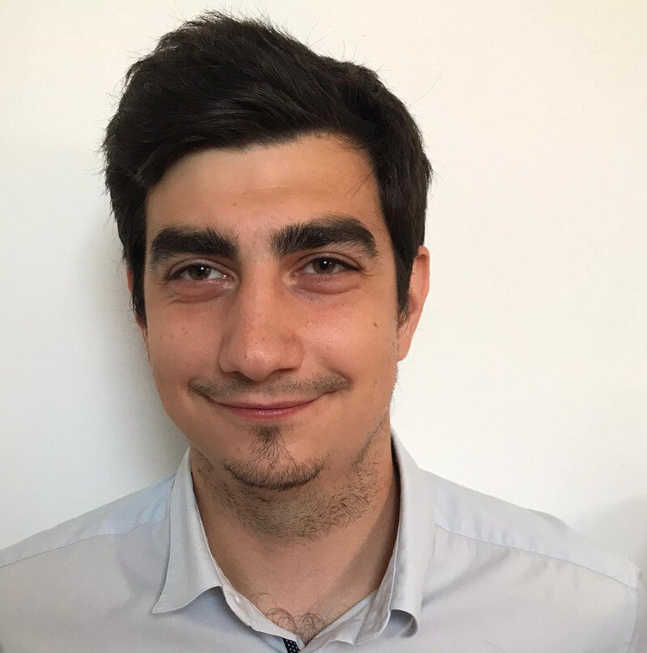
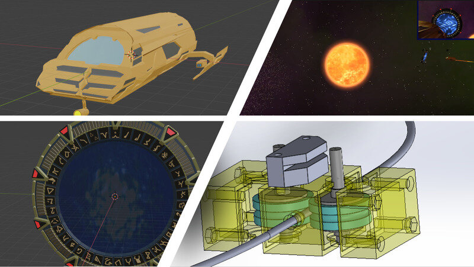
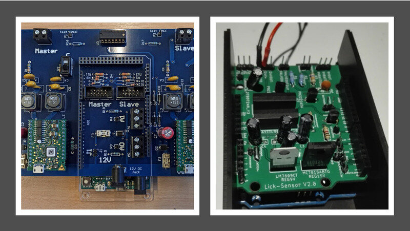
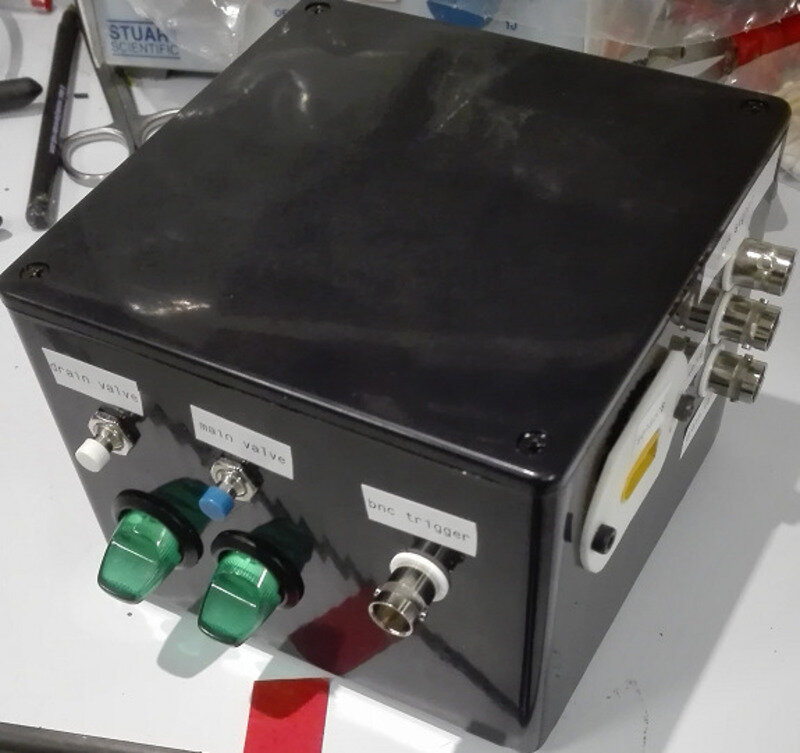
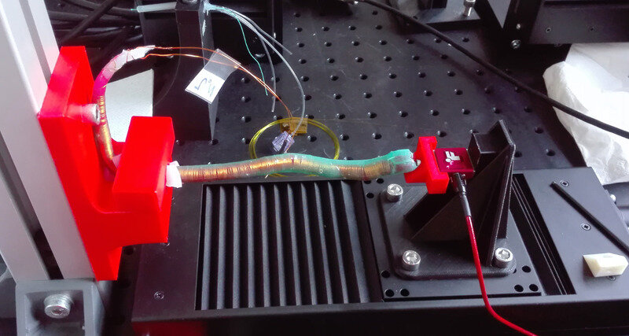

  <h1>Hello and welcome to my Student page !</h1>
  
Click on the buttons below to see my FabAc Journey...

  
...Or scroll to learn more about me

---

[My Final Project :fontawesome-solid-tools:](./project/final-project.md){: .md-button .md-button--primary}

[My Weekly Assignments :fontawesome-solid-lightbulb:](./modules/){: .md-button .md-button--primary}

## About me

Born during the terrible 1997 winter that all Belgians remember (or so my parents told me) in the big city that is _Brussels_, I later grew up in the countryside. This allowed me to build things every week-end in my backyard and make *a lot* of things ~~explode~~ disassemble very quickly under the quite worried, but very proud eyes of my father who taught me almost everything about tinkering.
>  When we come home, hide this scar from your mother or she's gonna scold me !

I knew very early that I wanted to make a career out of building _things_ but most importantly I wanted to understand _everything_. Yeah, I was this annoying kid at the mall asking its aunt what is every single item made of...

My grandfather taught me some basics of math, chemistry and biology very early in my childhood, explaining everything to me as it was a game. That was some impressive pedagogy when thinking back to it. That's how my passion for sciences started!

After graduating from high-school I had no idea at what to pick next... Not because I did not find a thing that picked my interest, but because I wanted to explore almost every single field in science.

And that's basically how I became an engineer! At that time I didn't know that it implied taking calculus courses that I still have nightmares about but hey, the Dirichlet's principle might get handy one day!

I chose to specialize in biomedical engineering because then I would get medicine course as well in my cursus (told you I'm a curious guy). I loved anatomy and physiology courses, it felt a like a nice breeze in-between Hamiltonians and Lagrangians. Plus, if astronauts ever get to Mars, they will need life-support systems !

## My technical background
Since my early childhood, I spent time developing small applications on my calculator (Casio 35+, I will always remember you) or on my PC, flashing cracked games on my GameBoy, selling burnt CD's at school or playing with my dad's soldering iron on _bring you kid to work's_ day.

Studying biomedical engineering, I learned a lot about electronics, mechanics and I got the basics of biology and anatomy down. However, I'm lacking in regards to the practical use of my hands and I know I'll have a lot to learn in that regards.

Here's what I've done in the past/what I can do:
- 3D modelling/vector-graphics:
  - SolidWorks
  - Blender
  - OpenGL: [here's a short-video of my OpenGL project](https://www.youtube.com/watch?v=6TVJTZ06IqM)

  <figure>
    
    <figcaption>Stargate Jumper and Stargate models in Blender, OpenGL videogame, Solidworks project</figcaption>
  </figure>
    

- Electronics and soldering:

<figure>
  
  <figcaption>Two examples of my electronics projects</figcaption>
</figure>

## My job
Right now, I'm right at the start of my PhD. I am also working part-time at the University (ULB - Brussels) as a teaching assistant, giving mainly electronics and medical devices courses.
My objective, in a 6-years timeframe, is to develop an implant that is able to monitor the bladder activity (pressure, contractions, volume and so on) to help people with decrease sensibility to manage their urinary problems, in particular people who suffered a spinal cord injury. Bladder issues are actually ranked first in multiple surveys by SCI despite being often reduced to only incontinence. Indeed, most people don't realize the tremendous consequences of a neurogenic bladder, including a very high mortality rate due to hydronephrosis or lower urinary tract infections. Being able to monitor the bladder activity would also allow to stimulate the afferent bladder nerves in a closed-feedback loop to prevent or reduce involuntary contractions.

## Some examples of my previous projects
#### Thermography
During an internship in Leeds, UK, I developed an I2C-based thermography system that is able to monitor the respiratory rate of experiment mice during olfactory tests. That was a very interesting project where I learned a lot about I2C communication protocol, electronics, C++ and many other things.

<figure>
  
  <figcaption>Thermography box</figcaption>
</figure>

#### Lick-sensor
For the same lab, I developed an automatic water delivery for behavioral experiments. The mice and rats could like a small catheter and the system would automatically deliver sugary or normal water in measured quantity based on the animal's behavior.

<figure>
  
  <figcaption>Lick-sensor box</figcaption>
</figure>

#### Triboelectricity
For my master thesis, I investigated the possibility to use Triboelectricity as a new type of passive sensor for mini-invasive surgeries or endoscopy. Triboelectricity is the fact that materials can exchange electrical charges on contact. With a specific design, it is possible to measure the elongation, bending, twisting of the sensor as well as the contact with the skin.

<figure>
  
  <figcaption>Triboelectric sensor on the test-bench</figcaption>
</figure>

## Why the FabAcademy ?

I always felt like I lacked practical experience, especially during my studies. I got familiar with several tools and processes that exist but I never got close to using them in practice. I feel like the FabAcademy is the place and time to switch from the theoretical point of view to a real hands-on experience with the idea to learn through mistakes and making.

 I want to learn transferrable skills that will be useful during my PhD and, subsequently, my whole career but most importantly I want to be able to build anything that comes to mind. Either for me, or for my friends.

I also think that project-based learning is probably one of the most efficient method there is and is well-suited for me.

Finally, the whole idea of sharing knowledge, ideas, softwares,... to give people the opportunity to learn is the perfect method to create an ever-growing system that will empower the humanity (or at least a part of it) and probably encourage a more sustainable consumption through repair and DIY options.

I think that the FabAcademy will really create the missing link between theory and practice for me and will help me for all my future projects.

## License
the license for this project is Creative Commons license. You are free to use everyting on this website for non-commercial use as long as you credit the author ([that's me!](index.md#about-me)) and that you license your new creations under identical terms. Please see the [project license](./about/license.md) for more details.
## Release notes
Any changes to this website will be listed on the [Release Notes](./about/release-notes.md) page.

## Student agreement
this website has been created for the purpose of the [FabAcademy course](http://fabacademy.org/). Feel free to have a look around ! I agreed to the _Student Agreement_ that you can see [here](./about/agreement.md).

## Get involved !
If you want to discuss about my work or propose any idea, feel free to send me an email, I'll be glad to have a chat with you !

[Send me a mail ! :fontawesome-solid-envelope:](mailto:maxime.verstraeten@ulb.be){: .md-button .md-button--primary}

