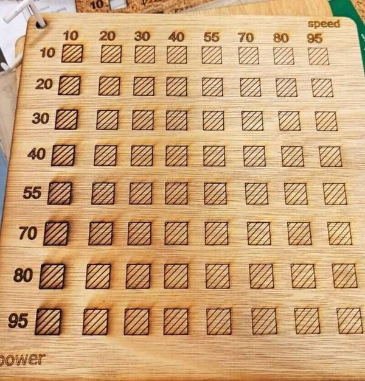

# Weekly Assignments Overview

Here are displayed my weekly assignments:

  

    <a href="./module00">
      
      
 Week 0:   Principles and Practices 

    </a>
  

  

    <a href="./module01">
      
      
 Week 1:   Project Management 

    </a>
  

  

    <a href="./module02">
      
      
 Week 2:   Computer-Aided Design 

    </a>
  

  

    <a href="./module03">
      
      
 Week 3:   Computer-Controlled Cutting 

    </a>
  

